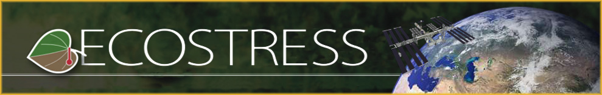

## Welcome

Welcome to the **2022 ECOSTRESS Cloud Workshop** hosted by NASA’s Land Processes Distributed Activate Archive ([LP DAAC]( https://lpdaac.usgs.gov/)) with support from [NASA Openscapes](https://nasa-openscapes.github.io/).

**The workshop will take place virtually daily on April 12 and 13, 2022 from 2pm-5:30pm PST [(UTC-7)](https://www.timeanddate.com/time/zones/pdt)**.

## About

### Workshop Goal

The goal of the workshop is expose ECOSTRESS data users to ECOSTRESS version 2 (v2) data products in the cloud. Learning objectives focus on how to find and access ECOSTRESS v2 data from Earthdata Cloud either by downloading or accessing the data on the cloud. The LP DAAC is the NASA archive for ECOSTRESS data products. ECOSTRESS v2 data products will hosted in the NASA Earthdata Cloud, hosted in AWS.

### Workshop Description

The goal of the workshop is expose ECOSTRESS data users to ECOSTRESS version 2 data products in the cloud. Learning objectives focus on how to finda and access ECOSTRESS version 2 data from Earthdata Cloud either by downloading or accessing the data on the cloud. The LP DAAC is the NASA archive for ECOSTRESS data products. ECOSTRESS version 2 data products will hosted in the NASA Earthdata Cloud, hosted in AWS.

The workshop will demonstrate how to find, access, and download ECOSTRESS v2 data from the Earthdata Cloud. Participants will learn how to search for and download data from NASA’s Earthdata Search Client, a graphical user interface (GUI) for search, discovery, and download application for also EOSDIS data assets. Participants will also learn how to perform in-could data search, access, and processing routines where no data download is required, and data analysis can take place next to the data in the cloud. 

### Workshop Outcomes

At the end of the two days, participants should be able to find and access ECOSTRESS v2 data in the NASA Earthdata Cloud (hosted in AWS). Workshop materials will be available for future reference following the completion of the workshop/ECOSTRESS Science Team meeting

> **NOTE:** ECOSTRESS v2 data will only be available to approved individuals. Please work with Christine Lee (christine.m.lee@jpl.nasa.gov) to have your name added to the allowlist. 

## Acknowledgements

2022 ECOSTRESS Cloud Workshop is hosted by NASA's LP DAAC with support from the NASA Openscapes Project, with cloud computing infrastructure by 2i2c. 
